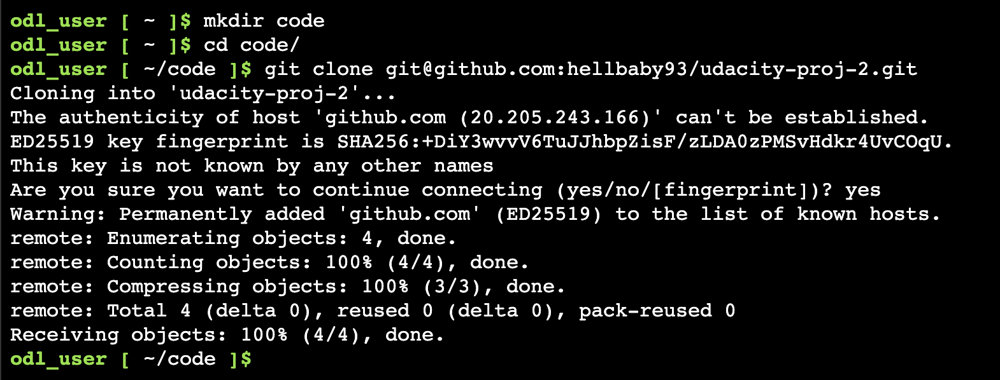
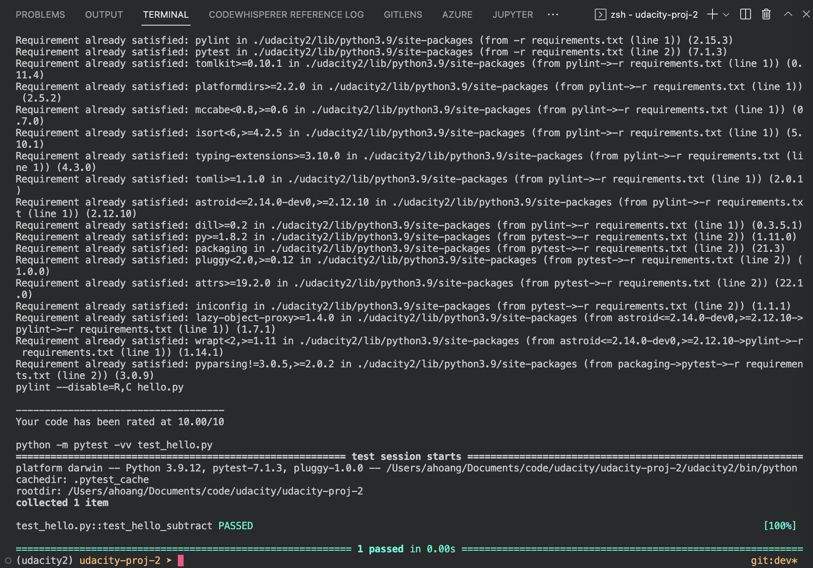
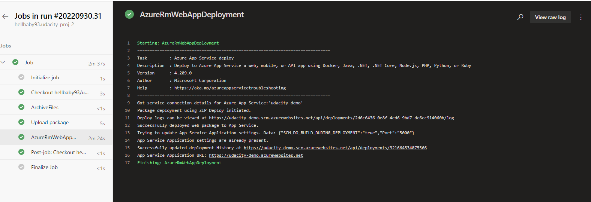
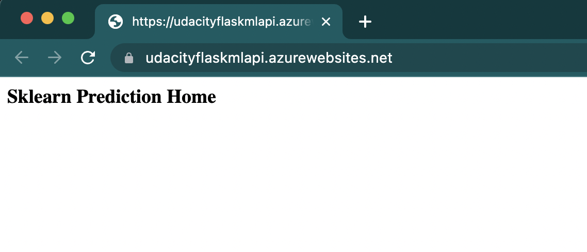
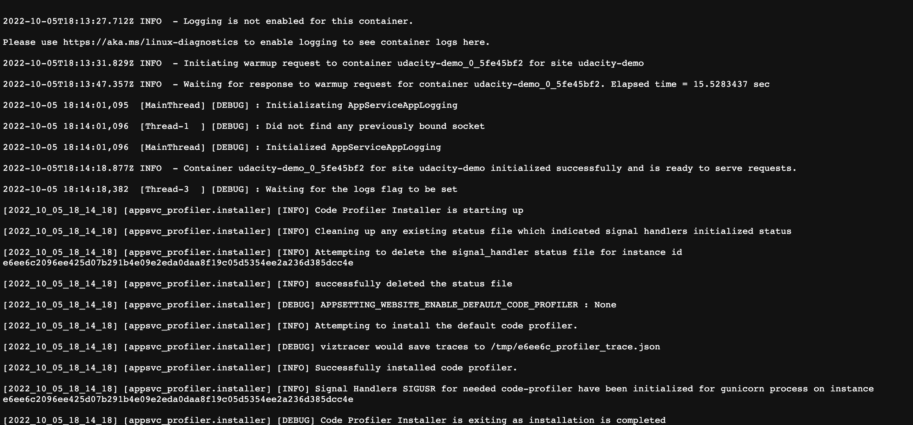

# Overview

[](https://github.com/hellbaby93/udacity-proj-2/actions/workflows/pythonapp.yml)

This repo is for demoing the automatic deployment to Microsoft Azure App Services using GitHub and Microsoft Azure DevOps pipeline

## Project Plan

* Link to a Trello board for the project: <https://trello.com/b/u6yE8VZE/udacity-project-2>
* Link to a spreadsheet that includes the original and final project plan: <https://docs.google.com/spreadsheets/d/1AwjJ8i2I2qFuF10Z3cZZRMMxG4o3FNbcpu4mktR2t7U/edit?usp=sharing>

## Instructions

* Architectural Diagram:


### Running on local environment:

Move to the application directory and run the following command:

```bash
make all
```

### Deploying to Azure App Services

The target is to Azure App Service as a build server and the host server for our Web Application, therefore you can follow these steps:

* Create Azure App Service by following this documentation: <https://learn.microsoft.com/en-us/azure/app-service/environment/using>

* Configure Azure App Service settings, make sure you set `SCM_DO_BUILD_DURING_DEPLOYMENT=true` by following this documentations:
  * <https://learn.microsoft.com/en-us/azure/app-service/configure-common?tabs=portal>
  * <https://learn.microsoft.com/en-us/azure/app-service/deploy-zip?tabs=cli#deploy-a-zip-package>

* Archive the source code using zip format and deploy to Azure App Service using following command:

```bash
az webapp deploy --resource-group <group-name> --name <app-name> --src-path <zip-package-path>
```

## The results

* Project running on Azure App Service

* Project cloned into Azure Cloud Shell



* Passing tests that are displayed after running the `make all` command from the `Makefile`



* Output of a test run

* Successful deploy of the project in Azure Pipelines



* Running Azure App Service from Azure Pipelines automatic deployment




* Successful prediction from deployed flask app in Azure Cloud Shell.


* KUDU Logstream.




## Enhancements / Issues

* The `requirements.txt` from Udacity originally does not work. Please visit my `requirements.txt` for working Python 3.7 Libraries.
* As of now Python 3.7 coming to the end of life. In the future, please make sure that you update the application to work with later version of Python.

## Demo

<https://youtu.be/B2YRMJ1uPs4>
